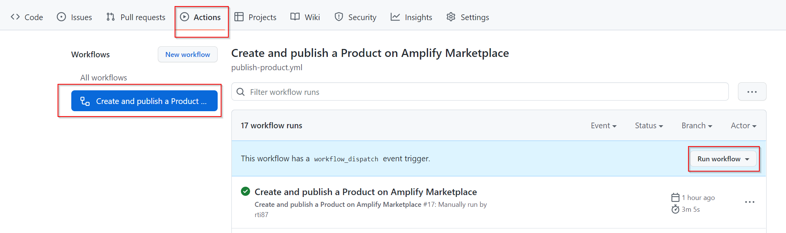

# Create and publish Amplify Product to Amplify Marketplace

This repository contains automation code to support a simple use case of creating a new Amplify Product in the Marketplace based on a single environment and single asset.

## Use case

The supported use case follows this logic:
1. One Axway API Management environment with discovery agent
2. All Service Instances created for this environment are grouped under a single Asset
3. This Asset is bundled into a Product
4. The Product has a single FREE subscription Product Plan
5. This Product is published to the existing Amplify Marketplace configured for your Organization

## Assumption

These are the assumptions to successfully run this project:
1. You have an active Amplify Organization with created Marketplace
2. You have a running Axway API Management instance connected to your Organization using the Axway discovery agent ([link](https://docs.axway.com/bundle/amplify-central/page/docs/connect_manage_environ/connect_api_manager/index.html))
3. You have an existing Amplify Service Account with Client Secrete for your ORG ([link](https://docs.axway.com/bundle/platform-management/page/docs/management_guide/organizations/managing_organizations/index.html#managing-service-accounts))

## Running this project

Follow these steps to use this project:

1. Fork this project to your GitHub account

2. Modify the `./config/env.properties` file by providing your chosen values for the parameters, like **ENVIRONMENT_NAME**, **ORGANIZATION**, etc.

3. Edit the content of the `./jq/doc_content.md` file to match your Product description. Use the markdown format.

4. (Optional) you can replace image files `./images/my-asset.png` and/or `./images/my-company.png` with your own images (you must keep the names as-is) that will be visible for created Asset and Product.

5. Push these updates to your repo.

6. Access your project in *github.com* under your account and add a variable **CLIENT_SECRET** (it must be this name) that matches your Amplify Service Account client's SECRET that will be used for this automation (add it to your project under ***Settings > Secrets > Actions***). This is a safe way for providing sensitive information for using in GitHub Actions.

   

7. Click the **Action** tab. You will need to click the **I understand my workflows, go ahead and enable them** link. 

8. Select **Create and publish a Product on Amplify Marketplace**. Click **Run workflow**. The action will prompt you for an input parameter - git branch. Accept the default values and click **Run workflow** in the pop-up window.

   

9.  GitHub executes this action in a container on its cloud. It will take a couple of minutes or so to complete. Come back to this page later and check the status. If the action is successful, you should see a green checkmark (like in the image above). If the workflow fails, you will need to click it in the *workflow runs* pane and review the logs. Correct an issue and re-run the workflow. FYI, Visual Studio Code has a nice plug-in to work with [GitHub Actions](https://marketplace.visualstudio.com/items?itemName=cschleiden.vscode-github-actions).

    **Important**: If this action already created some objects in Amplify (Asset and Product) before it failed, you need to delete these objects before re-running this action. 

10. Connect to your Amplify Organization and/or Marketplace and see the newly created Product.
